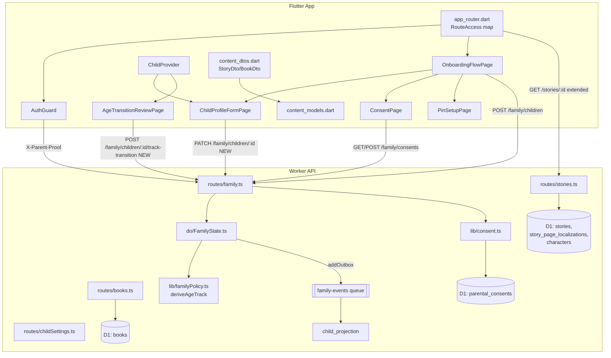

# Design Document

## Overview

هذا التصميم يغطي المرحلة 0 (الأساسات والحوكمة) والمرحلة 1 (رحلة الأسرة) من خطة إغلاق فجوات تطبيق مجرة، مطابقًا لـ`requirements.md` في هذا الـspec.

اكتشاف مهم غيّر نطاق العمل عن تقدير الخطة الأصلية: **الخادم والتخزين أكمل من الوثائق**. جدول `stories` يحمل فعليًا `reading_level` و`languages` و`default_language`؛ `characters` موجود ومرتبط بالصفحة عبر `story_bubbles.character_id`؛ `FamilyState` يخزّن `interests_json` و`language` لكل طفل ويحسب `age_track` بدالة مشتركة `deriveAgeTrack()` في `lib/familyPolicy.ts`؛ و`parental_consents` يخزّن `version` و`granted_at`/`revoked_at` بالفعل. الناقص الحقيقي هو: **تعريض** هذه البيانات في الـAPI العام والعميل، لا إنشاؤها من الصفر. كما أن **fail-open في PIN غير مؤكَّد بالكود** — `parent_pin_page.dart` لا يمنح وصولًا في أي مسار `catch`؛ هذا العمل يتحول من "إصلاح" إلى "اختبار قفل يمنع الانحدار".

لا حاجة لجداول `chapters`/`activities`/`narrators`/`similar_content` مستقلة: القصة الواحدة لا تحتاج جدول رواة مستقل بينما `story_page_localizations.narration_asset_id` موجود لكل صفحة بكل لغة — الراوي مُشتق من الأصل الصوتي لا كيان جديد. الفصول والأنشطة والمشابهات ستُشتق بحد أدنى (انظر §Data Model) بدل جداول فارغة تُصان بلا محتوى.

## Steering Document Alignment

### Technical Standards (tech.md)
لا يوجد `tech.md` في `.kiro/steering`. المعيار المتّبع هو الأسلوب القائم في `dashboard/api/src` (Hono + D1 + Durable Objects، معالجات `route.method('/path', handler)`، `queryFirst`/`queryAll` عبر `lib/db.ts`) وفي `app_main/lib` (Riverpod + GoRouter + DTO بدوال قسر في `content_dtos.dart`).

### Project Structure (structure.md)
لا يوجد `structure.md`. البنية المتبوعة: مسارات جديدة في `dashboard/api/src/routes/*.ts` مع مهاجرة SQL في `dashboard/api/migrations/NNNN_*.sql`؛ ونماذج/DTO في `app_main/lib/features/<feature>/domain` و`data`؛ وشاشات في `presentation/pages`؛ واختبارات مسطحة في `app_main/test/*.dart`.

## Code Reuse Analysis

### Existing Components to Leverage
- **`lib/familyPolicy.ts` (`deriveAgeTrack`, `PLAN_LIMITS`, `planAllows`)** — يُستخدم كما هو لحساب `age_track` والانتقال العمري؛ لا يُعاد تنفيذه في العميل.
- **`FamilyState` (`do/FamilyState.ts`)** — نضيف معالِجات جديدة (`PATCH /children/:id`, `/children/:id/track-transition`) بجانب `addChild`/`getChildren` القائمين، بنفس أسلوب `transactionSync` و`addOutbox`.
- **`parental_consents` + `lib/consent.ts`** — يُستخدمان دون تعديل في المخطط؛ الناقص هو مستهلك الواجهة فقط.
- **`AuthGuard` (`app_main/lib/app/router/auth_guard.dart`)** — يُوسَّع بحقل تصنيف المسار بدل استبداله؛ منطق `grantParentAccess`/`revokeParentAccess`/`hasParentAccess` يبقى كما هو لأنه يعمل بشكل صحيح ومختبَر ضمنيًا.
- **`content_dtos.dart` دوال القسر (`_text`, `_nullableText`, `_integer`, `_boolean`, `_objectList`)** — تُستخدم لكل حقل جديد في `StoryDto`/`BookDto`.
- **`story_page_localizations.narration_asset_id` + `content_assets`** — مصدر "الراوي" المشتق، بدل جدول جديد.
- **`_CreateChildSheet` (`child_switcher_page.dart:407-555`) وواجهة `ChildAvatarPicker`** — يُعاد استخدام حقول الإدخال والمُنتقي داخل الشاشة الكاملة الجديدة، لا إعادة كتابتها.
- **نمط اختبار `story_reader_dwell_test.dart`** — قالب لكل اختبار جديد (بدائل داخل الملف، `group` + حالات مرقّمة).

### Integration Points
- **`dashboard/api/src/index.ts`** — تركيب أي راوتر جديد يتبع نمط الأسطر 174-201 (لا راوتر جديد؛ التوسعة داخل `family.ts`, `stories.ts`, `books.ts`, `childSettings.ts` القائمة).
- **`app_router.dart`** — إعادة هيكلة القوائم الثلاث إلى خريطة تصنيف واحدة، مع الحفاظ على `refreshListenable: guard` و`errorBuilder` كما هما.
- **`home_providers.dart` / `child_provider.dart`** — إضافة حقول `interests`/`language` إلى `ChildState` دون تغيير `filteredCatalogProvider` القائم.
- **`family-events` queue consumer** — أي حدث جديد (`child.updated`, `child.track_transitioned`) يتبع نمط `child.created`/`child.deleted` الموجود بالفعل في `FamilyState.addOutbox` ومعالجه في `handleFamilyEvents`.

## Architecture



## Components and Interfaces

### Component 1: `RouteAccess` — مصفوفة تصنيف المسارات (يلبي Requirement 1, 2, 3)

- **Purpose:** استبدال ثلاث قوائم (`public`, `parentProtected`, `childRequired`) بخريطة واحدة فئة-لكل-مسار، مفحوصة باختبار شامل بدل قوائم يدوية متفرقة.
- **Location:** `app_main/lib/app/router/route_access.dart` (جديد).
- **Interfaces:**
  ```dart
  enum RouteAccess { public, authenticatedFamily, childSession, parentVerified }
  const Map<String, RouteAccess> routeAccessTable; // مسار → فئة، لكل مسار مُعرَّف في _routes
  RouteAccess accessFor(String location); // مطابقة دقيقة + بادئات /playback, /reader, /game, /series
  ```
- **Dependencies:** لا شيء؛ يُستهلك من `_guardRedirect` في `app_router.dart`.
- **Reuses:** منطق المطابقة بالبادئة القائم في `_guardRedirect` (`loc.startsWith('/playback')` إلخ) يُنقل هنا بلا تغيير سلوكي.

### Component 2: توسعة `AuthGuard` لفشل مغلق موثّق (يلبي Requirement 1)

- **Purpose:** لا تغيير سلوكي مطلوب (التحليل أثبت أن `AuthGuard` وقارئ PIN يفشلان مغلقًا فعلًا) — العمل هنا اختباري فقط: قفل السلوك الحالي بحيث لا ينحدر لاحقًا.
- **Location:** `app_main/test/parent_pin_fail_closed_test.dart` (جديد)، `app_main/test/route_guard_matrix_test.dart` (جديد).
- **Interfaces:** لا API جديدة.
- **Dependencies:** `AuthGuard`, `RouteAccess`.
- **Reuses:** `AuthGuard.grantParentAccess`/`hasParentAccess` كما هما.

### Component 3: تنظيف المسارات والملفات الميتة (يلبي Requirement 2, 3)

- **Purpose:** حذف `/series`, `/free`, `/library`, `/home-v2` من `_routes`، وحذف `home_v2_page.dart`, `parent_dashboard_page_v2.dart`, `studio_v2_router.dart` وكل استيراد حصري لها، وتوحيد بناء وجهات التنقل.
- **Location:** `app_router.dart`، `home_destinations.dart`، حذف ثلاثة ملفات، تعديل `adaptive_home_shell.dart:129` و`tv_home_shell.dart:107`.
- **Interfaces:**
  ```dart
  class HomeDestinationSpec { final String label; final IconData icon; final IconData selectedIcon; final Widget Function() build; }
  List<HomeDestinationSpec> buildHomeDestinationSpecs({required HomeCatalog catalog, required bool isTelevision, ...});
  ```
  الصدفتان تشتقان التسمية والأيقونة والجسم من نفس القائمة، فلا يتباعدان.
- **Reuses:** `buildHomeDestinations` القائمة تُعاد كتابتها بنفس التوقيع الخارجي حيث يمكن، لتقليل التغيير في نقاط الاستدعاء.

### Component 4: عقد القصة/الكتاب الموسّع — الخادم (يلبي Requirement 4)

- **Purpose:** توسعة `GET /stories/:id` و`GET /books/:id` بحقول مشتقة من الجداول القائمة بلا هجرة جديدة إلا لِما هو غائب فعلًا.
- **Location:** `dashboard/api/src/routes/stories.ts` (تعديل معالج `:id`، حول السطر 346-390)، `routes/books.ts` (حول السطر 270).
- **Interfaces (حقول إضافية في رد `GET /stories/:id`):**
  ```ts
  {
    // موجودة فعلًا، تُعاد كما هي: reading_level, languages, default_language, pages_count (COUNT(story_pages))
    narrators: Array<{ language: string; asset_id: string | null }>, // مُشتق: DISTINCT language من story_page_localizations حيث narration_asset_id NOT NULL
    listen_duration_ms: number | null, // SUM(duration_ms) عبر story_pages للغة الافتراضية؛ null إن كانت كل القيم null
    chapters: [], // لا مفهوم فصل في المخطط الحالي؛ مصفوفة فارغة صريحة إلى أن يُعرَّف تجميع صفحات لاحقًا
    characters: Array<{ id, name_ar, name_en, avatar_url }>, // JOIN عبر DISTINCT story_bubbles.character_id → characters
    similar: Array<{ id, title_ar, cover_url }>, // نفس series_id أو نفس planet عبر series، limit 6، يستثني القصة نفسها
    activities: [], // لا جدول أنشطة بعد القصة اليوم؛ مصفوفة فارغة صريحة
  }
  ```
- **Dependencies:** `characters`, `story_bubbles`, `story_page_localizations`, `series`.
- **Reuses:** أنماط `queryAll`/`queryFirst` القائمة في `stories.ts`؛ لا مكتبة جديدة.
- **قرار توثيقي:** `chapters` و`activities` تُعادان كمصفوفتين فارغتين صريحتين وليس حقلين محذوفين، وفقًا لـAcceptance Criteria 4.3. بناء هذين المفهومين فعليًا (تجميع صفحات، أنشطة بعد القصة) مؤجَّل لمرحلة كوكب القصص (مهمة الخطة 16) حيث تتضح الحاجة الحقيقية لبنية البيانات، بدل تخمينها الآن.

### Component 5: نقل العقد إلى `content_dtos.dart` و`content_models.dart` (يلبي Requirement 5)

- **Purpose:** تمثيل الحقول أعلاه في الدومين، وقراءة `pages_count` الذي يصل اليوم ولا يُقرأ.
- **Location:** `content_dtos.dart` (تعديل `StoryDto.fromJson` حول السطر 810)، `content_models.dart` (تعديل `StoryItem` حول السطر 462).
- **Interfaces:**
  ```dart
  class StoryNarrator { final String language; final String? assetId; }
  class StoryCharacterRef { final String id; final String nameAr; final String? nameEn; final String? avatarUrl; }
  class SimilarStoryRef { final String id; final String title; final String? coverUrl; }

  class StoryItem { // إضافات فقط، لا كسر بنّاء موجود لأن كل الحقول اختيارية بقيمة افتراضية
    final int? pagesCount; // موجود اليوم، يُعبَّأ فعليًا من json['pages_count']
    final List<StoryNarrator> narrators;
    final int? listenDurationMs;
    final String? readingLevel;
    final List<StoryCharacterRef> characters;
    final List<SimilarStoryRef> similar;
    final List<String> availableLanguages; // من json['languages'] القائم في الخادم
  }
  ```
- **Reuses:** دوال القسر `_text`/`_nullableText`/`_integer`/`_objectList` القائمة في `content_dtos.dart` بلا دوال قسر جديدة.

### Component 6: إصلاح انقطاعات العقد الثلاثة (يلبي Requirement 6)

- **Purpose:** تصحيح مسار نداء واحد، توحيد اسم باراميتر، وربط endpoint موجود.
- **Location:**
  - `app_main/lib/features/games/application/creative_catalogue_provider.dart:249` — `'$baseUrl/api/v1/reference-activities'` → `'$baseUrl/api/v1/creative/reference-activities'`.
  - `majarra_api_client.dart:732-735` (`fetchProgress`) — إرسال `child_id` مطابقًا لما يقرأه `family.ts:145` (`c.req.query('childId') ?? c.req.query('child_id')`؛ الخادم يقبل الاثنين فعلًا، فالإصلاح هنا اختبار عقد يثبت ذلك بدل تغيير كود، إلا إن أظهر الاختبار خلاف ذلك).
  - `majarra_api_client.dart` — إضافة `Future<void> markNotificationRead(String id)` ينادي `POST /api/v1/notifications/:id/read`، واستدعاؤه من شاشة الإشعارات عند الفتح.
- **Reuses:** `_postJson` القائمة في `majarra_api_client.dart`.

### Component 7: سياسة تعريب الأسطح الجديدة (يلبي Requirement 7)

- **Purpose:** بوابة اختبار ثابتة لا أداة تحويل جماعي.
- **Location:** `app_main/test/l10n_new_screens_policy_test.dart` (جديد)، تحديثات `lib/l10n/app_ar.arb`/`app_en.arb`/`app_fr.arb` لكل مفتاح يُستحدث في هذا الـspec.
- **Interfaces:** الاختبار يقرأ قائمة ملفات مُعرَّفة صريحًا (الملفات الجديدة في هذا وما بعده من specs) ويفحصها بتعبير نمطي عن سلسلة عربية حرفية داخل `Text(`/`'...'` بمعزل عن تعليقات الكود؛ القائمة تُحدَّث يدويًا مع كل spec جديد بدل فحص كل المستودع (الذي يحمل 1688 استثناءً قائمًا يجب عدم كسر بناءه).
- **Reuses:** `AppLocalizations.of(context) ?? AppLocalizationsAr()` نمط القراءة الدفاعي القائم.

### Component 8: `OnboardingFlowPage` (يلبي Requirement 8)

- **Purpose:** رحلة تهيئة بخطوات: الحساب (منجَز بالتسجيل) → الموافقات → إعداد PIN → إنشاء الطفل → الاهتمامات واللغة → الضوابط الأساسية → البدء.
- **Location:** `app_main/lib/features/onboarding/` (جديد): `presentation/pages/onboarding_flow_page.dart`, `application/onboarding_controller.dart`, `domain/onboarding_step.dart`.
- **Interfaces:**
  ```dart
  enum OnboardingStep { consent, pinSetup, childProfile, interestsLanguage, basicControls, finish }
  class OnboardingState { final OnboardingStep current; final Set<OnboardingStep> completed; }
  class OnboardingController extends StateNotifier<OnboardingState> { void advance(); void back(); void resumeFromPersisted(); }
  ```
  التخزين المحلي للموضع (لا سرّي) في `SharedPreferences` بمفتاح `onboarding_step_v1`، يُمحى عند اكتمال الخطوة الأخيرة.
- **Dependencies:** Component 9 (Consent)، Component 10 (Child)، Component 11 (PIN).
- **Reuses:** `_CreateChildSheet` fields منقولة إلى خطوة `childProfile` كصفحة كاملة لا bottom sheet.
- **حرس الدخول:** في `_guardRedirect`، بعد نجاح `authEntry` وقبل التوجيه إلى `/`، إن كان `guard.hasChild == false` **و** لا يوجد `onboarding_completed_at` على أي طفل → `/onboarding` بدل `/children` مباشرة. الطفل الثاني فصاعدًا يفتح مباشرة على خطوة `childProfile` فقط (Acceptance Criteria 8.6).

### Component 9: شاشة الموافقات (يلبي Requirement 9)

- **Purpose:** استهلاك `GET/POST /family/consents` القائمين.
- **Location:** `app_main/lib/features/onboarding/presentation/pages/consent_page.dart` (جديد، ويُعاد استخدامه من الإعدادات لاحقًا إن احتاج الوالد تعديل الموافقات بعد التهيئة).
- **Interfaces:**
  ```dart
  final consentsProvider = FutureProvider<Map<ConsentType, ConsentDecision>>((ref) => ...); // GET /family/consents → decisions
  Future<void> setConsent(ConsentType type, {String? childId, required bool grant}); // POST بإثبات manage_consents
  ```
- **Dependencies:** `authorizeParentAction('manage_consents')` من `majarra_api_client.dart` القائمة.
- **Reuses:** `fetchConsents`/`setConsent` الموجودتين في `MajarraApiClient` بلا تعديل توقيع.

### Component 10: `ChildProfileFormPage` + `PATCH /family/children/:id` (يلبي Requirement 10)

- **Purpose:** شاشة كاملة لإنشاء/تعديل ملف طفل بالاهتمامات واللغة، وأول مسار تعديل حقيقي لطفل قائم.
- **Location (خادم):** `dashboard/api/src/routes/family.ts` — معالج جديد `familyRoute.patch('/children/:childId', ...)` بجانب `POST /children` القائم (حول السطر 103)، بإثبات `manage_children` (موجود في `PARENT_PROOF_PURPOSES`). `do/FamilyState.ts` — معالج جديد `PATCH /children/:id` في خريطة `handlers` (حول السطر 515)، دالة `updateChild(request)` بجانب `addChild` القائمة (حول السطر 1896)، تتحقق من ملكية `childId` ثم تُحدِّث `nickname`/`avatar_id`/`language`/`interests_json` (لا `birth_month`/`birth_year`/`age_track` — هذه محصورة في مسار الانتقال العمري، Component 11) ثم `addOutbox('child.updated', {...})`.
- **Location (عميل):** `app_main/lib/features/child/presentation/pages/child_profile_form_page.dart` (جديد)؛ `child_switcher_page.dart` يُصبح مستدعيًا لهذه الصفحة بدل `_CreateChildSheet` (المنطق يُنقل لا يُكرَّر).
- **Interfaces:**
  ```dart
  Future<Map<String, dynamic>> updateChild(String childId, Map<String, Object?> body); // MajarraApiClient، جديد
  class ChildState { ...; final List<String> interests; final String? language; } // توسعة الحقول القائمة
  ```
- **Dependencies:** `deriveAgeTrack` (خادم فقط)، `PLAN_LIMITS[plan].children` (موجود، يُستخدم كما هو لفرض الحد).
- **Reuses:** `ChildAvatarPicker` widget، `existingNick` uniqueness check القائم في `addChild` — يُستخرج إلى دالة مشتركة `assertNicknameAvailable` تستخدمها `addChild` و`updateChild` كلتاهما بدل تكرار الاستعلام.

### Component 11: فصل إعداد PIN عن فتحه (يلبي Requirement 11)

- **Purpose:** لا تغيير في `POST /family/parent-pin` أو `/parent-pin/verify` (الخادم يفرّق أصلًا بين التسجيل الأول والتغيير عبر `expected_pin_version`). التغيير هو في العميل: صفحتان منفصلتان بدل صفحة واحدة بفرعين.
- **Location:** تقسيم `parent_pin_page.dart` إلى `pin_setup_page.dart` (تسجيل + تأكيد، بلا `expected_pin_version` عند أول تسجيل) و`pin_unlock_page.dart` (فتح فقط، تفويض بصمة أولًا). `route_access.dart` يوجّه: PIN غائب → `pin_setup_page`؛ PIN موجود → `pin_unlock_page`.
- **Interfaces:** لا تغيير على `MajarraApiClient.setParentPin`/`verifyParentPin`/`authorizeParentAction`.
- **Dependencies:** Component 2 (اختبار القفل يغطي كلا الصفحتين).
- **Reuses:** كل منطق `_completeUnlock`، `BiometricAvailability`، `parentPinStoreProvider` من الملف الحالي، مُقسَّمًا بين الملفين بلا إعادة كتابة.

### Component 12: الانتقال العمري (يلبي Requirement 12)

- **Purpose:** endpoint جديد كليًا — لا يوجد أي مسار انتقال اليوم؛ `age_track` يُقرأ فقط.
- **Location (خادم):** `family.ts` — `familyRoute.post('/children/:childId/track-transition', ...)` بجسم `{ action: 'accept' | 'defer' | 'review' }`. `do/FamilyState.ts` — معالج `POST /children/:id/track-transition`: يعيد حساب `deriveAgeTrack` من `birth_month`/`birth_year` المخزَّنين مقابل التاريخ الحالي؛ `accept` يكتب `age_track` الجديد ويُصدر `child.track_transitioned`؛ `defer` يكتب `track_transition_deferred_until` (عمود جديد، هجرة واحدة) بحد 30 يومًا ومرة واحدة فقط (يُرفض تأجيل ثانٍ قبل انقضاء الأول)؛ `review` يعيد المقارنة (المسار الحالي مقابل المحتسب) بلا كتابة.
- **Location (عميل):** `age_transition_review_page.dart` (جديد)، تُستدعى عند إشعار أو عند فتح لوحة الوالد إذا `computed_track != stored_track`.
- **Interfaces:**
  ```ts
  // family.ts
  familyRoute.post('/children/:childId/track-transition', ...) // +proof manage_children
  ```
  ```sql
  -- هجرة جديدة (خارج DO أيضًا لعمود المهلة إن احتاج قراءة D1 مباشرة؛ الأساس داخل DO storage)
  ALTER TABLE children ADD COLUMN track_transition_deferred_until INTEGER; -- داخل do/FamilyState.ts schema، عبر addColumn من lib/doSchema.ts
  ```
- **Dependencies:** `deriveAgeTrack`, `addOutbox`, `lib/doSchema.ts::addColumn` (نمط الترحيل الداخلي للـDO الموجود في `FamilyState.ts:15`).
- **Reuses:** نمط `transactionSync` + `addOutbox` + `scheduleOutbox` من `addChild` بالضبط.

## Data Models

### إضافات هجرة D1 (خارج الـDO)
لا هجرة D1 جديدة مطلوبة لهذا الـspec. كل الحقول المُشتقة في Component 4 تُحسب من الأعمدة والجداول القائمة (`stories`, `story_pages`, `story_page_localizations`, `story_bubbles`, `characters`, `series`, `books`). عمود `track_transition_deferred_until` يعيش داخل تخزين `FamilyState` (SQLite-in-DO) عبر `lib/doSchema.ts::addColumn`، لا في D1، لأن كل حالة الطفل مصدرها الوحيد الحقيقي هو الـDO (`children_profiles`/`child_projection` في D1 قراءة فقط/إسقاط).

### `StoryItem` (Flutter، إضافات على الموديل القائم في `content_models.dart:462`)
```dart
class StoryItem {
  // ... الحقول القائمة بلا تغيير ...
  final int? pagesCount;               // كان معرَّفًا وغير مُعبَّأ؛ يُعبَّأ الآن
  final String? readingLevel;          // من json['reading_level'] الموجود خادميًا
  final List<String> availableLanguages; // من json['languages'] الموجود خادميًا
  final List<StoryNarrator> narrators;
  final int? listenDurationMs;
  final List<StoryCharacterRef> characters;
  final List<SimilarStoryRef> similar;
  final List<dynamic> chapters;   // فارغة دائمًا في هذا الـspec، نوعها Never عمليًا
  final List<dynamic> activities; // فارغة دائمًا في هذا الـspec
}
```

### `ChildState` (Flutter، توسعة `child_provider.dart:8`)
```dart
class ChildState {
  final String? activeChildId;
  final String? ageTrack;
  final String? displayName;
  final List<String> interests;   // جديد
  final String? language;         // جديد
  final DateTime? onboardingCompletedAt; // جديد، من body /family/children
}
```

## Error Handling

### Error Scenario 1: فشل الشبكة أثناء التحقق من PIN
- **Handling:** لا وصول يُمنح (fail-closed مؤكَّد بالكود القائم)؛ تُعرض رسالة `l10n.sessionExpiredShort`/رسالة شبكة عامة بحسب نوع الخطأ.
- **User Impact:** يبقى في شاشة الفتح مع زر إعادة محاولة؛ لا ينتقل إلى أي مسار `parentVerified`.

### Error Scenario 2: تعديل طفل بإثبات منتهي
- **Handling:** `familyRoute.patch('/children/:childId')` يرد 403 `parentProofDenied('invalid')`؛ العميل يعيد فتح `pin_unlock_page` بـ`from=` المسار الحالي.
- **User Impact:** لا تُفقد بيانات النموذج المُدخلة؛ تُحفظ في حالة النموذج محليًا حتى نجاح إعادة الإثبات.

### Error Scenario 3: انتقال عمري بلا إثبات والد
- **Handling:** `track-transition` يتطلب `manage_children` proof مثل `PATCH`؛ غيابه يرد 403 قبل أي قراءة أو كتابة.
- **User Impact:** الطفل لا يرى شاشة المراجعة أصلًا لأنها خلف `parentVerified`.

### Error Scenario 4: قصة بحقول جديدة غائبة كليًا (محتوى قديم لم يُحدَّث)
- **Handling:** الخادم يعيد `null`/`[]` صريحًا (Acceptance Criteria 4.3)؛ الـDTO يقرأها بدوال القسر القائمة فتُنتج نموذجًا صالحًا بحقول فارغة، لا استثناء.
- **User Impact:** صفحة تفاصيل القصة (مرحلة لاحقة) تُخفي القسم الفارغ بدل عرض شاشة خطأ.

### Error Scenario 5: طفل ثانٍ يُنشأ أثناء رحلة تهيئة أب لم يكتمل هو نفسه
- **Handling:** الحرس يتحقق من طفل واحد على الأقل بـ`onboarding_completed_at` غير فارغ، لا من اكتمال "الحساب" ككل؛ إنشاء الطفل الثاني يفتح مباشرة على `childProfile` فقط لأن الموافقات وPIN مرتبطان بالحساب لا بالطفل.

## Testing Strategy

### Unit Testing
- `route_guard_matrix_test.dart`: كل مسار في `_routes` مُصنَّف في `routeAccessTable`؛ فشل الاختبار عند وجود مسار بلا فئة (يلبي 1.2, 8.4).
- `parent_pin_fail_closed_test.dart`: محاكاة فشل شبكة/خادم عبر Mock `MajarraApiClient` يرمي استثناء في `setParentPin`/`verifyParentPin`؛ التأكد أن `AuthGuard.hasParentAccess` يبقى `false`.
- `content_dtos_test.dart` (توسعة): حالات قصة كاملة الحقول، ناقصة، بمصفوفات فارغة، بقيم فاسدة لـ`narrators`/`characters`.
- `home_destinations_labels_test.dart`: تطابق عدد ووصف كل تسمية مع كل جسم شاشة في القائمة المُشتركة.
- Worker: اختبارات `stories.test.ts`/`books.test.ts` (توسعة) لحقول Component 4؛ `family.test.ts` (توسعة) لـ`PATCH /children/:id` و`track-transition` (حد الباقة، رفض عمر خارج 3-12، تأجيل مرة واحدة، بقاء عدد سجلات التقدم).
- `l10n_new_screens_policy_test.dart`: قائمة ملفات مُعرَّفة صريحًا لا تحتوي literal عربي معروض.

### Integration Testing
- تدفق التهيئة الكامل: تسجيل → موافقات → PIN → طفل → اهتمامات/لغة → بدء، مع محاكاة خروج ورجوع في كل خطوة يثبت استرجاع الموضع (`SharedPreferences` مُموَّهة في الاختبار).
- تدفق تعديل طفل: فتح `parentVerified` بلا إثبات → إعادة توجيه PIN → نجاح → تعديل → عودة إلى المسار الأصلي (`from=`).
- تدفق الانتقال العمري: طفل بعمر 5 سنوات و11 شهرًا يُقدَّم زمنيًا في الاختبار عبر `now` القابل للحقن في `deriveAgeTrack` → تأكيد ظهور شاشة المراجعة → قبول → تأكيد ثبات عدد سجلات `progress`/`mastery`/`rewards` قبل وبعد.

### End-to-End (Manual, على جهاز حقيقي)
- فتح كل مسار `parentVerified` برابط عميق مباشر بعد تسجيل خروج، والتأكد من إعادة التوجيه لا الوصول.
- تعديل ملف طفل من التطبيق فعليًا، والتأكد من ظهور الاهتمامات في استجابة `homeCatalogProvider` التالية (تجريبيًا فقط؛ الفلترة الفعلية بالاهتمامات مرحلة لاحقة).
- **ما لا يمكن تحققه بهذا الـspec:** لا صوت ولا فيديو حقيقي في القاعدة (0 أصل)، فحقل `narrators`/`listen_duration_ms` سيُختبر ببيانات تجريبية مُدرَجة يدويًا في `story_page_localizations`، لا بمحتوى إنتاج حقيقي.

## Correctness Properties

هذه خصائص ثابتة يجب أن تصمد أمام أي مُدخل صالح، لا سيناريوهات فردية. تُختبر بـproperty-based tests حيث ينطبق ذلك (`test/*_property_test.dart` أو حالات مولَّدة داخل الاختبار الحالي).

### Property 1: إحكام تصنيف المسارات

لكل مسار `p` في `_routes`، `routeAccessTable[p]` معرَّف ومن نوع `RouteAccess` واحد بالضبط. لا مسار بلا فئة، ولا مسار بفئتين.

**Validates: Requirements 1.1, 1.2**

### Property 2: اتساق فئة parentVerified

لكل مسار `p` حيث `routeAccessTable[p] == parentVerified`، فتحه بأي حالة `AuthGuard.hasParentAccess == false` يُنتج توجيهًا إلى `/parent-pin` — لا استثناء، بصرف النظر عن سبب غياب الوصول (لا إثبات، إثبات منتهٍ، طفل مُبدَّل، فشل شبكة).

**Validates: Requirements 1.3, 1.4**

### Property 3: أحادية اتجاه fail-closed

لا يوجد أي مسار تنفيذ يُنتج `hasParentAccess == true` إلا عبر `grantParentAccess` بمدخل `proof` غير فارغ و`expiresAt` مستقبلي فعلي من رد خادمي ناجح. أي مسار `catch`/فشل/timeout لا يستدعي `grantParentAccess` مطلقًا.

**Validates: Requirements 1.5**

### Property 4: صمود عقد القصة أمام أي شكل رد

لتحويل `StoryDto.fromJson(json)` مهما كان شكل `json` (حقول غائبة، `null`، أنواع خاطئة، مصفوفات فارغة) — التحويل لا يرمي استثناءً، وحقول `chapters`/`activities`/`narrators`/`characters`/`similar` تكون دومًا قوائم صالحة (فارغة أو معبَّأة) لا `null` غير معالَج.

**Validates: Requirements 5.3, 4.3**

### Property 5: حفظ سجلات التقدم عبر الانتقال العمري

لكل طفل يمر بـ`track-transition action=accept`، عدد صفوف `progress`/`mastery`/`rewards`/`favorites` المرتبطة بـ`child_id` قبل العملية يساوي عددها بعدها تمامًا (تغيير `age_track` فقط، صفر حذف أو تكرار).

**Validates: Requirements 12.2, 12.7**

### Property 6: حصرية التأجيل

لكل طفل، لا يمكن أن يوجد أكثر من تأجيل نشط واحد (`track_transition_deferred_until` مستقبلي) في وقت واحد؛ طلب تأجيل ثانٍ قبل انقضاء الأول يُرفض دومًا برمز 409/400 لا يُصمَت عنه.

**Validates: Requirements 12.3**

### Property 7: استقلال اهتمامات الأطفال

تعديل `interests`/`language`/`avatar_id` لطفل عبر `PATCH /children/:childId` لا يغيّر أي حقل لطفل آخر في نفس الأسرة، مهما تكرر الاستدعاء أو تزامن مع طلبات أخرى (يُختبر بطلبين متزامنين على طفلين مختلفين من نفس الأسرة).

**Validates: Requirements 10.4, 10.7**

### Property 8: اتساق تسمية/محتوى الوجهات

لكل فهرس `i` في قائمة الوجهات المُشتركة، `label(i)` و`icon(i)` و`build(i)` مُشتقة من نفس عنصر `HomeDestinationSpec` الواحد في كل من الهاتف والتابلت والتلفزيون — تغيير أحدها في المصدر الواحد ينعكس في الثلاثة بلا تعديل يدوي متكرر.

**Validates: Requirements 3.3, 3.5**
