# Implementation Plan

## Overview

خطة تنفيذ المرحلتين 0 (الأساسات والحوكمة) و1 (رحلة الأسرة). المهام مرتبة بترتيب الاعتماد: مهام الخادم (Worker/D1/DO) تسبق مهام العميل التي تستهلكها. كل مهمة تنتج زيادة قابلة للتحقق ببناء واختبار حقيقيين لا وصفًا نظريًا. المراجع بين قوسين تشير إلى Requirement.Criterion في `requirements.md`.

## Task Dependency Graph

```mermaid
graph TD
    T1[1. RouteAccess map] --> T2[2. _guardRedirect rewrite]
    T2 --> T3[3. route_guard_matrix_test]
    T2 --> T4[4. parent_pin_fail_closed_test]
    T2 --> T5[5. حذف مسارات وملفات ميتة]
    T5 --> T6[6. HomeDestinationSpec موحّد]
    T6 --> T7[7. home_destinations_labels_test]

    T8[8. GET /stories/:id موسّع] --> T9[9. GET /books/:id موسّع]
    T8 --> T10[10. اختبارات عقد الخادم]
    T9 --> T10
    T10 --> T11[11. StoryDto/StoryItem موسّعة]
    T11 --> T12[12. content_dtos_test موسّع]

    T13[13. إصلاح مسار reference-activities]
    T14[14. اختبار عقد fetchProgress]
    T15[15. markNotificationRead]
    T16[16. مراجعة endpoints بلا مستدعٍ]

    T17[17. سياسة تعريب الأسطح الجديدة] --> T21
    T17 --> T23
    T17 --> T28
    T17 --> T30
    T17 --> T32

    T18[18. PATCH /children/:id في FamilyState] --> T19[19. تعريض PATCH في family.ts]
    T19 --> T20[20. اختبارات Worker لحدود العمر/الباقة]
    T19 --> T21[21. ChildProfileFormPage]
    T21 --> T22[22. اختبار Widget لحدود النموذج]

    T2 --> T23[23. تقسيم PIN إلى إعداد/فتح]
    T23 --> T24[24. اختبار تدفق PIN الكامل]

    T25[25. POST track-transition في FamilyState] --> T26[26. اختبار خاصية حفظ التقدم]
    T25 --> T27[27. اختبار خاصية حصرية التأجيل]
    T25 --> T28[28. AgeTransitionReviewPage]

    T29[29. OnboardingStep/Controller] --> T32
    T30[30. ConsentPage] --> T32
    T30 --> T31[31. ربط سحب الموافقة بإيقاف السلوك]
    T21 --> T32[32. OnboardingFlowPage]
    T23 --> T32
    T32 --> T33[33. اختبار تكامل رحلة التهيئة]

    T3 --> T34[34. تحقق نهائي كامل]
    T4 --> T34
    T7 --> T34
    T12 --> T34
    T16 --> T34
    T20 --> T34
    T22 --> T34
    T24 --> T34
    T26 --> T34
    T27 --> T34
    T33 --> T34
```



```json
{
  "waves": [
    { "wave": 1, "tasks": [1, 8, 13, 14, 15, 16, 17, 18, 25, 29] },
    { "wave": 2, "tasks": [2, 9, 19] },
    { "wave": 3, "tasks": [3, 4, 5, 10, 20, 21, 23, 26, 27] },
    { "wave": 4, "tasks": [6, 11, 22, 24, 28, 30] },
    { "wave": 5, "tasks": [7, 12, 31] },
    { "wave": 6, "tasks": [32] },
    { "wave": 7, "tasks": [33] },
    { "wave": 8, "tasks": [34] }
  ]
}
```
**مسار حرج:** 1 → 2 → 5 → 6 (تنظيف الراوتر والصدف) بالتوازي مع 8 → 9 → 10 → 11 (عقد المحتوى) وبالتوازي مع 18 → 19 → 21 (ملف الطفل) و 23 (PIN) و 25 (الانتقال العمري)، وكل هذه تتقاطع في 32 (رحلة التهيئة) قبل 34 (التحقق النهائي). المهام 13، 14، 15، 16 مستقلة ويمكن تنفيذها بالتوازي مع أي مما سبق.

## Tasks
- [x] 1. تصنيف المسارات في خريطة واحدة (`RouteAccess`)
  - أنشئ `app_main/lib/app/router/route_access.dart` بـ`enum RouteAccess { public, authenticatedFamily, childSession, parentVerified }` وخريطة `routeAccessTable` تغطي كل مسار قائم في `_routes` اليوم، ودالة `accessFor(String location)` تطابق المسار الدقيق ثم البادئات (`/playback`, `/reader`, `/game`, `/series`).
  - استخرج منطق `public`/`parentProtected`/`childRequired`/بادئات الأسطر 70-181 في `app_router.dart` إلى هذه الخريطة بلا تغيير في نتيجة أي مسار قائم.
  - _Requirements: 1.1, 1.6, 1.7_

- [x] 2. استبدال `_guardRedirect` بمنطق يعتمد على `RouteAccess`
  - أعد كتابة `_guardRedirect` في `app_router.dart` ليستخدم `accessFor(loc)` بدل القوائم الثلاث، مع الحفاظ على استثناءات `isDemo`/`authEntry`/`/reset-password` كما هي.
  - وجّه `parentVerified` بلا `hasParentAccess` إلى `/parent-pin?from=<loc>`، و`childSession` بلا طفل نشط إلى `/children`.
  - _Requirements: 1.3, 1.4, 1.6_

- [x] 3. اختبار `route_guard_matrix_test.dart` يفشل على مسار بلا فئة
  - اختبار يقارن كل مسار في `_routes` (مستخرَجة بالاسم صريحًا في الاختبار) مع مفاتيح `routeAccessTable`، ويفشل إن وُجد مسار في أحدهما غائب عن الآخر.
  - حالات لكل فئة: `parentVerified` بلا إثبات → `/parent-pin`؛ `childSession` بلا طفل → `/children`؛ `public` بلا جلسة → يبقى مسموحًا.
  - _Requirements: 1.2, 8.4 (في requirements.md: Requirement 13.4)_

- [x] 4. اختبار قفل fail-closed لـPIN (`parent_pin_fail_closed_test.dart`)
  - Mock لـ`MajarraApiClient` يرمي استثناء شبكة/خادم من `setParentPin`/`verifyParentPin`؛ تأكيد أن `AuthGuard.hasParentAccess` يبقى `false` ولا يُستدعى `grantParentAccess` في أي مسار `catch`.
  - حالة إضافية: انتهاء `expiresAt` يُسقط `hasParentAccess` فور مرور الوقت (`Timer` في `revokeParentAccess`).
  - _Requirements: 1.5_

- [x] 5. حذف المسارات والملفات غير القابلة للوصول
  - احذف تعريفات `/series`, `/free`, `/library`, `/home-v2` من `_routes` في `app_router.dart` (مع إبقاء إعادة توجيه `/home-v2 → /` إن كان لها موقع استدعاء قائم، وإلا حذفها أيضًا بعد التأكد).
  - احذف `home_v2_page.dart`, `parent_dashboard_page_v2.dart`, `studio_v2_router.dart` وكل ملف يُستورد منها وحدها فقط (تحقق بالبحث عن كل موقع استيراد قبل الحذف).
  - شغّل `flutter analyze` وتأكد من صفر تحذيرات ناتجة عن الحذف.
  - _Requirements: 2.1, 2.2, 2.3, 2.5_

- [x] 6. توحيد وجهات التنقل في مصدر واحد (`HomeDestinationSpec`)
  - أنشئ `HomeDestinationSpec { label, icon, selectedIcon, build }` وقائمة مُشتركة تستهلكها `adaptive_home_shell.dart` (الهاتف والتابلت) و`tv_home_shell.dart`، بدل التسميات المكتوبة يدويًا في كل صدفة.
  - صحّح تسمية الوجهة الثالثة في الصدفتين (`adaptive_home_shell.dart:129`, `tv_home_shell.dart:107`) لتطابق `LibraryPage` المعروضة فعليًا فعليًا، لا "بحث".
  - _Requirements: 3.1, 3.2, 3.3, 3.4_

- [x] 7. اختبار تطابق تسمية/جسم الوجهات (`home_destinations_labels_test.dart`)
  - لكل عنصر في `HomeDestinationSpec` المُشتركة، تأكيد أن عدد التسميات يساوي عدد الشاشات المبنية، وأن كل زوج (تسمية، جسم) متطابق في الهاتف والتابلت والتلفزيون.
  - _Requirements: 3.5_

- [x] 8. توسعة `GET /stories/:id` بالحقول المُشتقة (خادم)
  - في `dashboard/api/src/routes/stories.ts`، وسِّع معالج `:id` (حول السطر 346) بحقول: `narrators` (DISTINCT language من `story_page_localizations` حيث `narration_asset_id NOT NULL`)، `listen_duration_ms` (SUM(`duration_ms`) عبر `story_pages` للغة الافتراضية)، `characters` (JOIN عبر DISTINCT `story_bubbles.character_id` → `characters`)، `similar` (نفس `series_id` أو نفس الكوكب عبر `series`، حد 6، استثناء القصة نفسها)، `chapters: []`, `activities: []`.
  - أعد `reading_level`, `languages`, `default_language` الموجودة فعلًا في جدول `stories` بلا حذف أو إعادة تسمية.
  - تأكد أن غياب أي مصدر (لا رواة، لا شخصيات) يعيد `null`/`[]` صريحًا لا حذف المفتاح.
  - _Requirements: 4.1, 4.3, 4.4, 4.5_

- [x] 9. تطبيق نفس التوسعة على `GET /books/:id`
  - في `routes/books.ts` (حول السطر 270)، أضف الحقول القابلة للتطبيق على الكتب من نفس المنطق (لا `characters` إن لم توجد `book_bubbles` مكافئة — وثّق الغياب صريحًا في الرد بدل افتراض توافق البنية).
  - _Requirements: 4.2, 4.3_

- [x] 10. اختبارات عقد الخادم للحقول الموسّعة (`stories.test.ts`, `books.test.ts`)
  - حالة قصة كاملة الحقول (رواة، شخصيات، مشابهات)، حالة قصة بلا أي منها (تعيد قوائم فارغة لا استثناء)، حالة قصة غير منشورة (تحتفظ بسلوك الحجب القائم).
  - _Requirements: 4.3, 4.4, 4.6_

- [x] 11. نقل العقد الموسّع إلى `content_dtos.dart` و`content_models.dart`
  - أضف `StoryNarrator`, `StoryCharacterRef`, `SimilarStoryRef` في `content_models.dart`، ووسِّع `StoryItem` بـ`pagesCount` (يُعبَّأ فعليًا من `json['pages_count']`)، `readingLevel`, `availableLanguages`, `narrators`, `listenDurationMs`, `characters`, `similar`, `chapters`, `activities`.
  - وسِّع `StoryDto.fromJson` في `content_dtos.dart` باستخدام دوال القسر القائمة (`_text`, `_nullableText`, `_integer`, `_objectList`) لكل حقل جديد، بلا دوال قسر جديدة وبلا رمي استثناء عند قيمة فاسدة.
  - _Requirements: 5.1, 5.2, 5.3, 5.4_

- [x] 12. اختبارات تحويل الحقول الجديدة (`content_dtos_test.dart`)
  - حالات: JSON كامل الحقول، JSON بحقول غائبة، JSON بأنواع خاطئة (مثل `narrators` كسلسلة نصية بدل مصفوفة)، JSON بمصفوفات فارغة — كل حالة تُنتج `StoryItem` صالحًا بلا استثناء.
  - _Requirements: 5.5_

- [x] 13. إصلاح مسار الأنشطة المرجعية 404
  - في `creative_catalogue_provider.dart:249`، صحّح `'$baseUrl/api/v1/reference-activities'` إلى `'$baseUrl/api/v1/creative/reference-activities'`.
  - أضف معالجة خطأ شبكة قابلة لإعادة المحاولة بدل رمي استثناء غير معالَج عند الفشل.
  - _Requirements: 6.1, 6.2_

- [x] 14. اختبار عقد باراميتر `fetchProgress`
  - اختبار Worker يثبت أن `GET /family/progress` يقبل كلا الاسمين `childId` و`child_id`؛ إن أظهر الاختبار أن أحدهما غير مقبول فعليًا، صحّح `family.ts:145` ليقبل الاثنين مطابقةً لـ`/family/rewards`.
  - _Requirements: 6.3_

- [x] 15. ربط تعليم الإشعار مقروءًا
  - أضف `Future<void> markNotificationRead(String id)` في `majarra_api_client.dart` ينادي `POST /api/v1/notifications/:id/read`، واستدعها من شاشة الإشعارات عند فتح إشعار غير مقروء، مع تحديث حالته في الواجهة فور نجاح النداء.
  - _Requirements: 6.4_

- [x] 16. مراجعة وتوثيق مصير كل endpoint بلا مستدعٍ
  - راجع القائمة: `GET /analytics/events`, `POST /notifications/test`, `POST /creations/reconcile`, `GET /creative/reference-activities/:id` — لكل واحد، قرر ربطه أو حذف تعريفه، ووثّق القرار في تعليق أعلى المعالج.
  - _Requirements: 6.5_

- [x] 17. سياسة تعريب الأسطح الجديدة
  - أضف اختبار `l10n_new_screens_policy_test.dart` يحمل قائمة مسارات ملفات صريحة (الشاشات الجديدة في هذا الـspec) ويفحصها بتعبير نمطي يكشف سلسلة عربية حرفية معروضة (`Text('...عربي...')`) خارج التعليقات.
  - لكل شاشة جديدة تُبنى في المهام التالية، أضف مفاتيحها إلى `app_ar.arb` بوصف `@key`، وقيمًا في `app_en.arb`/`app_fr.arb`، وأعد توليد `app_localizations*.dart`.
  - _Requirements: 7.1, 7.2, 7.3, 7.5_

- [x] 18. إضافة `PATCH /children/:childId` في `FamilyState` (خادم)
  - في `do/FamilyState.ts`، أضف `updateChild(request)` بجانب `addChild` (حول السطر 1896): تحقق من ملكية `childId` (`status='active'`)، حدّث `nickname`/`avatar_id`/`language`/`interests_json` فقط (لا `birth_month`/`birth_year`/`age_track`)، أصدر `child.updated` عبر `addOutbox`.
  - استخرج فحص تفرد `nickname` من `addChild` إلى دالة مشتركة `assertNicknameAvailable` يستخدمها كلا المعالجين.
  - أضف `'PATCH /children/:id': (r) => this.updateChild(r)` إلى خريطة `handlers` (حول السطر 515).
  - _Requirements: 10.4, 10.6_

- [x] 19. تعريض `PATCH /family/children/:childId` في `family.ts`
  - أضف `familyRoute.patch('/children/:childId', ...)` بجانب `POST /children` (حول السطر 103)، يتطلب `manage_children` proof، ويمرر الجسم إلى `FamilyState` كما تفعل `POST /children`.
  - _Requirements: 10.4_

- [x] 20. اختبارات Worker لإنشاء/تعديل الطفل بحدود العمر والباقة
  - حالات: رفض عمر 2 و13، قبول حدود 3/5/6/8/9/12، رفض تجاوز `PLAN_LIMITS[plan].children`، تعديل طفل بإثبات صالح ينجح، تعديل بإثبات منتهٍ يرد 403 قبل أي كتابة.
  - _Requirements: 10.3, 10.5, 10.8_

- [x] 21. `ChildProfileFormPage` — شاشة كاملة بدل `_CreateChildSheet`
  - انقل حقول `_CreateChildSheet` (`child_switcher_page.dart:407-555`) و`ChildAvatarPicker` إلى `app_main/lib/features/child/presentation/pages/child_profile_form_page.dart`، بوضعين: إنشاء وتعديل، مع إضافة حقلي `interests` (اختيار من قائمة مغلقة) و`language`.
  - أضف `updateChild` إلى `MajarraApiClient` (استدعاء `PATCH /family/children/:id` بإثبات `manage_children` عبر `authorizeParentAction`).
  - وسِّع `ChildState` بـ`interests` و`language` و`onboardingCompletedAt` في `child_provider.dart`.
  - اربط `child_switcher_page.dart` بفتح هذه الصفحة بدل الـbottom sheet القديم للإنشاء، وبنفس الصفحة بوضع التعديل لكل طفل قائم.
  - _Requirements: 10.1, 10.2, 10.6, 10.7_

- [x] 22. اختبار Widget لحدود عمر النموذج والاهتمامات
  - اختبار يدخل تواريخ ميلاد عند حدود 3/5/6/8/9/12 ويؤكد رسالة الرفض عند 2 و13، ويؤكد ظهور الاهتمامات واللغة في حالة الحفظ.
  - _Requirements: 10.8_

- [x] 23. تقسيم `parent_pin_page.dart` إلى إعداد وفتح
  - أنشئ `pin_setup_page.dart` (إدخال + تأكيد PIN، بلا `expected_pin_version` عند أول تسجيل) و`pin_unlock_page.dart` (فتح فقط، تفويض بصمة أولًا مع تراجع إلى PIN)، منقولًا منهما منطق `_completeUnlock`, `BiometricAvailability`, `parentPinStoreProvider` من الملف الحالي بلا إعادة كتابة.
  - وجّه في `route_access.dart`/`_guardRedirect`: لا PIN مسجَّل → `pin_setup_page`؛ PIN موجود → `pin_unlock_page`، وكلاهما يقرأ ويستخدم باراميتر `from` للعودة بعد النجاح.
  - احذف `parent_pin_page.dart` القديم بعد نقل كل استدعاء لمساريه الجديدين.
  - _Requirements: 11.1, 11.2, 11.3, 11.5, 11.6_

- [~] 24. اختبار تدفق PIN الكامل (إعداد → قفل → فتح → تغيير)
  - إعداد أول مرة، ثم قفل التطبيق (محاكاة)، ثم فتح ناجح بالبصمة وبدونها، ثم تغيير PIN بإثبات `change_parent_pin` مستهلَك لمرة واحدة (إعادة استخدامه يفشل)، ثم محاولة إدخال متكرر خاطئ تؤكد رسالة تحديد المعدل بلا كشف عدد المحاولات المتبقية.
  - _Requirements: 11.4, 11.7_

- [x] 25. إضافة `POST /children/:childId/track-transition` (خادم)
  - في `do/FamilyState.ts`، أضف معالج الانتقال العمري: يعيد حساب `deriveAgeTrack(birth_month, birth_year)` مقابل التاريخ الحالي القابل للحقن في الاختبار، ويدعم `action: 'accept' | 'defer' | 'review'`.
  - أضف عمود `track_transition_deferred_until` عبر `lib/doSchema.ts::addColumn` (نمط الترحيل الداخلي الموجود في `FamilyState.ts:15`).
  - `accept`: يكتب `age_track` الجديد فقط (لا تغيير على أي جدول تقدم آخر)، يُصدر `child.track_transitioned`. `defer`: يكتب موعد مستقبلي بحد 30 يومًا، ويرفض تأجيلًا ثانيًا قبل انقضاء الأول (409). `review`: يعيد المقارنة (المسار الحالي مقابل المحتسب) بلا كتابة.
  - أضف `familyRoute.post('/children/:childId/track-transition', ...)` في `family.ts` بإثبات `manage_children`.
  - _Requirements: 12.1, 12.3, 12.4, 12.5, 12.6_

- [x] 26. اختبار خاصية حفظ سجلات التقدم عبر الانتقال (Property 5)
  - اختبار Worker: طفل بسجلات `progress`/`mastery`/`rewards`/`favorites` موجودة مسبقًا، يمر بـ`action=accept`، يؤكد تطابق عدد كل جدول قبل وبعد العملية تمامًا، مع تغيّر `age_track` فقط.
  - _Requirements: 12.2_

- [x] 27. اختبار خاصية حصرية التأجيل (Property 6)
  - اختبار Worker: طلب `defer` أول ينجح، طلب `defer` ثانٍ قبل انقضاء الأول يُرفض بـ409/400، طلب `defer` بعد انقضاء الأول ينجح من جديد.
  - _Requirements: 12.3_

- [x] 28. `AgeTransitionReviewPage` (عميل)
  - شاشة تعرض `review` (المسار الحالي مقابل المحتسب) وتتيح `accept`/`defer` بإثبات والد، تُفتح من لوحة الوالد أو إشعار عندما `computed_track != stored_track`.
  - _Requirements: 12.4, 12.5_

- [x] 29. `OnboardingStep`, `OnboardingController`, واسترجاع الموضع
  - أنشئ `app_main/lib/features/onboarding/domain/onboarding_step.dart` (`enum OnboardingStep { consent, pinSetup, childProfile, interestsLanguage, basicControls, finish }`) و`application/onboarding_controller.dart` بحفظ الموضع في `SharedPreferences` (`onboarding_step_v1`) ومحوه عند اكتمال آخر خطوة.
  - _Requirements: 8.2, 8.3_

- [x] 30. `ConsentPage` — استهلاك `/family/consents` القائم
  - أنشئ `consent_page.dart` يقرأ `GET /family/consents` ويعرض `decisions` كما يحسبها الخادم، ويكتب عبر `POST /family/consents` بإثبات `manage_consents`، مع تحديث العرض من رد الخادم فقط لا تفاؤليًا.
  - إن تغيّرت نسخة السياسة، اعرض طلب موافقة جديدة ولا تعتبر الموافقة القديمة سارية.
  - _Requirements: 9.1, 9.2, 9.3, 9.4, 9.5, 9.7_

- [x] 31. ربط سحب الموافقة بإيقاف السلوك المعتمد عليها فورًا
  - حدد نقاط استهلاك كل `ConsentType` في التطبيق (مثل التحليلات) واربطها بقراءة القرار الحالي بدل تخزين علم محلي منفصل، فسحب الموافقة يوقف الإرسال من الطلب التالي فورًا.
  - _Requirements: 9.6_

- [x] 32. `OnboardingFlowPage` — تجميع الخطوات وحرس الدخول
  - أنشئ `onboarding_flow_page.dart` يستضيف `ConsentPage`, `PinSetupPage` (من المهمة 23), `ChildProfileFormPage` (من المهمة 21) بوضع الإنشاء، وخطوة الضوابط الأساسية وخطوة البدء.
  - في `_guardRedirect`، وجّه الحساب المصادَق بلا أي طفل حامل `onboarding_completed_at` إلى `/onboarding` بدل `/children`. أرسل `onboarding_completed_at` مع إنشاء الطفل الأخير في الرحلة.
  - عند إضافة طفل ثانٍ من مستخدم مكتمل التهيئة، افتح `ChildProfileFormPage` وحدها بلا خطوات الحساب/الموافقات/PIN.
  - _Requirements: 8.1, 8.4, 8.5, 8.6, 8.7_

- [x] 33. اختبار تكامل لرحلة التهيئة الكاملة
  - تسجيل → موافقات → PIN → طفل → اهتمامات/لغة → بدء، مع خروج ورجوع في كل خطوة يثبت استرجاع الموضع من `SharedPreferences`، وتأكيد أن حسابًا أكمل الرحلة سابقًا يفتح على الوجهة المعتادة بلا أي خطوة تهيئة.
  - _Requirements: 8.3, 8.5_

- [x] 34. تحقق نهائي: بناء واختبارات كاملة للـspec
  - شغّل `flutter analyze` و`flutter test` كاملين على العميل، وفحص الأنواع ومجموعة اختبارات الـWorker كاملة على الخادم.
  - راجع الخصائص الثمانية في `design.md` (Correctness Properties) واحدة تلو الأخرى وأكد وجود اختبار يغطي كل واحدة بالاسم.
  - وثّق في تقرير قصير ما تحقق منه فعليًا على جهاز حقيقي (المهمة اليدوية في §Testing Strategy → End-to-End) وما بقي غير مُتحقَّق منه بسبب غياب أصول صوت/فيديو حقيقية.
  - _Requirements: 13.1, 13.2, 13.3, 13.4, 13.5, 13.6_

## Notes

- **fail-open في PIN غير مؤكَّد بالكود:** المهام 3 و4 اختبارات قفل تمنع الانحدار، لا إصلاحًا لخلل موجود — التحليل أثبت أن `parent_pin_page.dart` الحالي يفشل مغلقًا فعلًا.
- **لا هجرة D1 جديدة** لعقد المحتوى (المهام 8-12): كل الحقول تُشتق من `stories`, `story_pages`, `story_page_localizations`, `story_bubbles`, `characters`, `series` القائمة. العمود الجديد الوحيد (`track_transition_deferred_until`) يعيش داخل تخزين `FamilyState` الداخلي (المهمة 25)، لا في D1.
- **`chapters` و`activities` تبقيان فارغتين عمدًا** في هذا الـspec (المهمة 8) — بناؤهما الفعلي مؤجَّل لمرحلة كوكب القصص حيث تتضح بنية البيانات الحقيقية.
- **حد التحقق:** لا صوت أو فيديو حقيقي في القاعدة، فحقول `narrators`/`listen_duration_ms` (المهام 8، 10) تُختبر ببيانات تجريبية مُدرَجة يدويًا، لا محتوى إنتاج فعلي. هذا القيد يُذكر في تقرير المهمة 34 صريحًا.
- **ترتيب تنفيذ داخل sub-agent:** المهام 1-16 يمكن تفويضها لـ`spec-task-execution` بالتسلسل الموضح في الرسم؛ المهام 17-33 تعتمد على استكمال 18-19 و23 و25 قبل تجميعها في 32.
